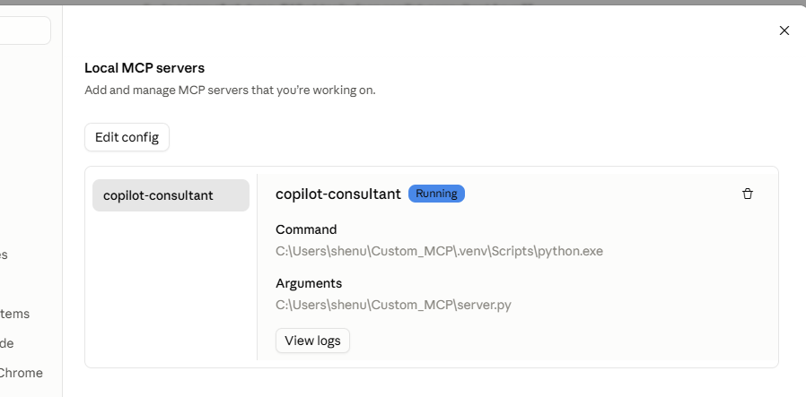

# Install the Copilot Consultant MCP in your AI apps

Created by Shenuka Fernando. © 2026 Shenuka Fernando. All rights reserved.

| App | How it connects | What you need first |
|-----|-----------------|---------------------|
| [Claude Desktop](#a-claude-desktop) | Starts the MCP on your PC (STDIO) | [Setup on your PC](#setup-on-your-pc) |
| [Claude Code](#b-claude-code) | Starts the MCP on your PC (STDIO) | Setup on your PC |
| [OpenAI Codex app](#c-openai-codex-app-local) | Starts the MCP on your PC (STDIO) | Setup on your PC |
| [ChatGPT (web and desktop app)](#d-chatgpt-web-and-desktop-app) | Remote HTTPS URL, in Developer mode | A public HTTPS address ([DEPLOYMENT.md](DEPLOYMENT.md)) |
| [Copilot Studio](#e-copilot-studio) | Remote HTTPS URL | A public HTTPS address |
| [Copilot Cowork](#f-copilot-cowork) | Plugin package pointing to a remote HTTPS URL | A public HTTPS address + Microsoft 365 admin |
| [Microsoft 365 Copilot agents](#g-microsoft-365-copilot-agents-and-agent-builder) | Via Copilot Studio or a declarative agent | A public HTTPS address |
| [Automatic Copilot usage download](#h-automatic-copilot-usage-download-microsoft-graph) | Optional add-on for any of the above | An Entra ID app registration in the client's tenant |

**Which URL?** Local apps (Claude Desktop, Claude Code, Codex) don't use a URL: they start `server.py` themselves.
Cloud apps (ChatGPT, Copilot Studio, Cowork) need `https://<public address>/mcp` from a Dev Tunnel or Azure,
because they can't reach `localhost` on your PC. See [DEPLOYMENT.md](DEPLOYMENT.md#step-2-give-it-a-public-https-address).

App menus change often. If a label below doesn't match what you see, follow the linked vendor docs.

---

## Setup on your PC

Windows PowerShell:

```powershell
cd C:\Users\<you>
git clone https://github.com/shenukaf69/Custom_MCP.git
cd Custom_MCP
python -m venv .venv
.venv\Scripts\Activate.ps1
pip install -r requirements.txt
python demo.py
```

`demo.py` should print results and open a sample dashboard. If PowerShell says running scripts is disabled, run
`Set-ExecutionPolicy -Scope CurrentUser RemoteSigned` once.

To update later: `cd` into the folder, activate `.venv`, `git pull`, `pip install -r requirements.txt`, then
restart your AI app.

---

## A. Claude Desktop

1. In Claude Desktop, go to **Settings > Developer > Edit Config**. This opens the folder with
   `claude_desktop_config.json`. Open that file in Notepad.
2. **Save a backup copy first** (File > Save As, for example `claude_desktop_config.backup.json`), then reopen the
   original.
3. Add the `mcpServers` block **right after the first `{`**, keeping everything else. Use your own path and keep
   the double backslashes:

   ```json
   {
     "mcpServers": {
       "copilot-consultant": {
         "command": "C:\\Users\\<you>\\Custom_MCP\\.venv\\Scripts\\python.exe",
         "args": ["C:\\Users\\<you>\\Custom_MCP\\server.py"]
       }
     },
     "...your existing settings stay here...": "..."
   }
   ```

   Note the comma after the `mcpServers` block's closing `}`. A missing comma makes the file invalid.
4. **Fully quit Claude** (right-click the tray icon > **Quit**) and reopen it.
5. **Settings > Developer** should show **copilot-consultant** as **Running**.
6. In a new chat: *"What tools does copilot-consultant have?"* It should list 10 tools. Click **Allow** when Claude
   first uses a tool.



Troubleshooting: select **View logs** on that Settings page, or open `%APPDATA%\Claude\logs\` (files starting with
`mcp`). `ModuleNotFoundError` means the `command` path isn't the `python.exe` inside `.venv`.

## B. Claude Code

```powershell
claude mcp add copilot-consultant -- C:\Users\<you>\Custom_MCP\.venv\Scripts\python.exe C:\Users\<you>\Custom_MCP\server.py
```

Then start `claude` and ask *"What tools does copilot-consultant have?"*.

## C. OpenAI Codex app (local)

The Codex app can start local (STDIO) MCP servers like Claude Desktop does.

1. Open the **gear menu** > **MCP servers** > **Add server**.
2. Name: `copilot-consultant`. Type: **STDIO**.
3. Command: `C:\Users\<you>\Custom_MCP\.venv\Scripts\python.exe`, with the argument
   `C:\Users\<you>\Custom_MCP\server.py`.
4. Save, then ask Codex to list the copilot-consultant tools.

([Codex: Model Context Protocol](https://developers.openai.com/codex/mcp))

## D. ChatGPT (web and desktop app)

ChatGPT connects to **remote** MCP servers only, through **Developer mode**. It can't start `server.py` on your PC.

**What you need**
- A public HTTPS address for the server ([DEPLOYMENT.md Step 2](DEPLOYMENT.md#step-2-give-it-a-public-https-address)).
- **Run the server without `MCP_API_KEY`.** ChatGPT offers OAuth or no authentication, not API keys. For client
  data, use OAuth (Entra ID) instead; see [DEPLOYMENT.md](DEPLOYMENT.md#production-sign-in-oauth).
- A plan that supports it. According to OpenAI, full MCP support (including tools that create files) is on
  **Business, Enterprise and Edu**; **Pro** is limited to read/fetch tools. Check OpenAI's page for your plan.

**Steps**
1. Business, Enterprise or Edu only: a workspace admin turns on Developer mode in **Workspace settings >
   Permissions & roles** (Developer mode / create custom MCP connectors).
2. In ChatGPT, open **Settings** and turn on **Developer mode** (under Security and login, or Apps > Advanced
   settings, depending on version).
3. Go to **Apps** (or **Plugins**) and select **+ / Create**. Enter:
   - Name: `Copilot Consultant`
   - MCP server URL: `https://<public address>/mcp` (include `/mcp`)
   - Authentication: **No authentication** (or OAuth)
4. Create the app. In a chat, pick it from the composer's **Developer mode** tools and ask:
   *"Assess Copilot readiness: licences yes, DLP no, SharePoint reviewed no, sponsor yes, change plan yes."*
5. Generated decks and dashboards come back as download links.

Only connect servers you trust; developer mode gives the model tools that can act. The same app appears in the
ChatGPT desktop app and on the web because it's saved to your account. OpenAI also offers a **Secure MCP Tunnel**
for servers on private networks.

([Developer mode and MCP apps in ChatGPT](https://help.openai.com/en/articles/12584461-developer-mode-and-mcp-apps-in-chatgpt),
[ChatGPT Developer mode](https://developers.openai.com/api/docs/guides/developer-mode),
[Secure MCP Tunnel](https://developers.openai.com/api/docs/guides/secure-mcp-tunnels.md))

## E. Copilot Studio

Needs a public HTTPS address. Set `MCP_API_KEY` on the server for this one.

**Standard harness ("classic"):** turn on generative orchestration, then **Tools > Add a tool > New tool > Model
Context Protocol**. Enter the name, description, `https://<public address>/mcp`, and **API key** authentication
(Header, name `x-api-key`). Create the connection, **Add to agent**, and test.

**GitHub Copilot harness (preview):** **Build** tab > **Tools** > **Add** > **Model Context Protocol (MCP)**, same
details, then **Save** and test on the **Preview** tab.

**Publish to Teams and Microsoft 365 Copilot:** **Publish** > **Channels** > **Teams and Microsoft 365 Copilot**.

Full steps: [DEPLOYMENT.md Steps 3 to 5](DEPLOYMENT.md#step-3-copilot-studio-standard-harness-classic).

## F. Copilot Cowork

Needs a public HTTPS address and a Microsoft 365 admin. Run the server **without** `MCP_API_KEY` (Cowork doesn't
support API keys) or with OAuth.

```powershell
python m365/cowork-plugin/build_cowork_plugin.py --url https://<public address>/mcp --privacy-url https://<site>/privacy --terms-url https://<site>/terms
```

Upload `m365/cowork-plugin/dist/copilot-consultant-cowork.zip` in the **Microsoft 365 admin center > Manage apps >
Upload custom app** (**…** > **Add agent**), then in **Cowork > Sources & Skills > Plugins** add **Copilot
Consultant**. Attach a Copilot Dashboard export in Cowork and the tools read it directly.

Full steps: [DEPLOYMENT.md Step 6](DEPLOYMENT.md#step-6-copilot-cowork).

## G. Microsoft 365 Copilot agents and Agent Builder

Agent Builder can't add MCP servers. Use a **Copilot Studio agent published to Microsoft 365 Copilot** (section E),
or a **declarative agent from Microsoft 365 Agents Toolkit** in VS Code (**Declarative Agent > Add an Action >
Start with an MCP Server**). See [DEPLOYMENT.md Step 7](DEPLOYMENT.md#step-7-declarative-agents-the-alternative-to-agent-builder).

---

## H. Automatic Copilot usage download (Microsoft Graph)

The `download_copilot_usage` tool downloads the **Microsoft 365 Copilot usage reports (v2)** from Microsoft Graph
into your **Downloads** folder, so you don't have to export them by hand. It's optional: every other tool works
without it.

**What you get:** three CSV files (per-user detail, summary, daily trend) and a summary in the chat. It covers
licensed users, active users per app (Teams, Outlook, Word, Excel, PowerPoint, Copilot Chat, Edge, agents),
prompts submitted and active days, for the last 7, 28, 90 or 180 days.

**What it doesn't include:** meeting hours summarised and creation actions. You need those for Microsoft's full
assisted-hours ROI, so use a Copilot Dashboard export for exact figures or give estimates. Copilot Chat usage by
people without a Copilot licence isn't in Graph either. The tool gives a **lower-bound** figure: prompts × 6 minutes,
which is how Microsoft counts Copilot Chat prompts.

### 1. Register an app in the client's tenant (an admin does this once)

A **Global Administrator** or **Privileged Role Administrator** is needed to grant the consent.

1. Go to the [Microsoft Entra admin center](https://entra.microsoft.com) > **Entra ID** > **App registrations** >
   **New registration**.
2. Name: `Copilot Consultant MCP - usage reports`. Account type: **this organisational directory only**. Leave
   **Redirect URI** empty. Select **Register**.
3. On **Overview**, copy the **Application (client) ID** and the **Directory (tenant) ID**.
4. **API permissions** > **Add a permission** > **Microsoft Graph** > **Application permissions** >
   **Reports.Read.All** > **Add permissions**. Then select **Grant admin consent for <tenant>**. The status must
   show a green tick.
5. **Certificates & secrets** > **Client secrets** > **New client secret**. Pick a short expiry (for example
   6 months) and copy the **Value** straight away. It's only shown once. Copy the Value, not the Secret ID.

`Reports.Read.All` lets the app read Microsoft 365 **usage reports** only. It can't read anyone's mail, files,
chats or calendars. See [Microsoft's permission reference](https://learn.microsoft.com/graph/permissions-reference#reportsreadall).

If the client's admin creates the app, ask them to share the secret through a password manager or a secure share,
**never by email or chat**.

### 2. Store the details on your PC

The MCP reads three **environment variables**. You never type the secret into the chat.

| Variable | Value |
|----------|-------|
| `COPILOT_GRAPH_TENANT_ID` | Directory (tenant) ID, or the domain, e.g. `contoso.onmicrosoft.com` |
| `COPILOT_GRAPH_CLIENT_ID` | Application (client) ID |
| `COPILOT_GRAPH_CLIENT_SECRET` | The client secret **Value** |

**Recommended: Windows user environment variables.** Only your Windows account can read them, and nothing is saved
in the repository or the Claude config file. In PowerShell (the secret prompt hides what you type, so it doesn't
end up in your command history):

```powershell
[Environment]::SetEnvironmentVariable("COPILOT_GRAPH_TENANT_ID", "contoso.onmicrosoft.com", "User")
[Environment]::SetEnvironmentVariable("COPILOT_GRAPH_CLIENT_ID", "<application-client-id>", "User")
$secret = Read-Host "Client secret" -MaskInput
[Environment]::SetEnvironmentVariable("COPILOT_GRAPH_CLIENT_SECRET", $secret, "User")
Remove-Variable secret
```

Then **fully quit Claude Desktop** (tray icon > Quit) and reopen it, so it picks up the new variables.

**Alternative: the Claude Desktop config.** Add an `env` block to the server entry. It works, but the secret is
then stored as plain text in `claude_desktop_config.json`, so don't share or back up that file anywhere public:

```json
"copilot-consultant": {
  "command": "C:\\Users\\<you>\\Custom_MCP\\.venv\\Scripts\\python.exe",
  "args": ["C:\\Users\\<you>\\Custom_MCP\\server.py"],
  "env": {
    "COPILOT_GRAPH_TENANT_ID": "contoso.onmicrosoft.com",
    "COPILOT_GRAPH_CLIENT_ID": "<application-client-id>",
    "COPILOT_GRAPH_CLIENT_SECRET": "<secret-value>"
  }
}
```

**Several clients:** add the client's name to the end of each variable name, e.g. `COPILOT_GRAPH_TENANT_ID_CONTOSO`,
`COPILOT_GRAPH_CLIENT_ID_CONTOSO` and `COPILOT_GRAPH_CLIENT_SECRET_CONTOSO`. Then say *"for Contoso"* in the prompt
(the tool's `tenant_profile` is `contoso`). The files are named after the profile.

**Hosted server (Azure Container Apps):** keep the secret as a Container Apps secret, not a plain environment variable:

```powershell
az containerapp secret set -n copilot-consultant -g rg-copilot-consultant --secrets graph-secret=<secret-value>
az containerapp update -n copilot-consultant -g rg-copilot-consultant --set-env-vars `
  COPILOT_GRAPH_TENANT_ID=<tenant-id> COPILOT_GRAPH_CLIENT_ID=<client-id> COPILOT_GRAPH_CLIENT_SECRET=secretref:graph-secret
```

Hosted, the files come back as download links instead of going to Downloads. Protect the server with an API key or
OAuth ([DEPLOYMENT.md](DEPLOYMENT.md)), because anyone who can call it can download that tenant's usage reports.

### 3. Try it

```
Download Copilot usage for the last 28 days.
```
```
Download Contoso's Copilot usage for the last 90 days, then create an ROI dashboard for Contoso in SGD using those numbers: S$92 an hour, S$38.40 per licence, S$50,000 rollout costs, 1 meeting hour and 3 creation actions per user per week.
```

### How the MCP uses the secret

1. When the tool runs, `graph_usage.py` reads the three variables from the environment that Claude Desktop (or the
   server host) started `server.py` with.
2. It sends the client ID and secret over HTTPS to `login.microsoftonline.com/<tenant>` (the OAuth 2.0
   **client credentials** flow) and gets back an **access token** that's valid for about an hour.
3. It calls `graph.microsoft.com/v1.0/copilot/reports/...` with that token. When Graph redirects to the file
   download, the token isn't sent on to the download address.
4. The token is kept **in memory only** and reused for about an hour. It's forgotten when the app closes.
5. The secret and the token are **never** written to disk, logged, put in the files, or returned to the AI. The AI
   only sees the summary and the file paths. The per-user CSVs stay on your PC.

**Housekeeping:** set a reminder before the secret expires, then create a new one and update the variable. Delete
the app registration (or its secret) when the engagement ends. Sign-in and usage show in the client's Entra
**sign-in logs** under the app's name.

**Names in the files:** by default Microsoft 365 hides user names in reports and shows scrambled IDs. The totals are
the same either way. An admin can change this in **Microsoft 365 admin center > Settings > Org settings > Reports**.

**Network:** needs `login.microsoftonline.com` and `graph.microsoft.com` (HTTPS 443). Graph may redirect the file
download to another Microsoft address, so if a proxy blocks it, the error names the address to allow.

**Common errors**

| Message | Fix |
|---------|-----|
| Not set up yet: set the environment variable(s) … | Set the variables named in the message, then fully restart Claude |
| Sign-in failed (401) … Invalid client secret | You copied the Secret ID instead of the Value, or the secret has expired |
| Sign-in failed (400) … not found in the directory | Wrong tenant ID, or the app was created in a different tenant |
| Microsoft Graph refused access (403) | `Reports.Read.All` is missing, is a delegated permission instead of an application permission, or admin consent wasn't granted |

([Copilot usage report API](https://learn.microsoft.com/microsoft-365/copilot/extensibility/api/admin-settings/reports/copilotreportroot-getmicrosoft365copilotusageuserdetail),
[client credentials flow](https://learn.microsoft.com/entra/identity-platform/v2-oauth2-client-creds-grant-flow))
