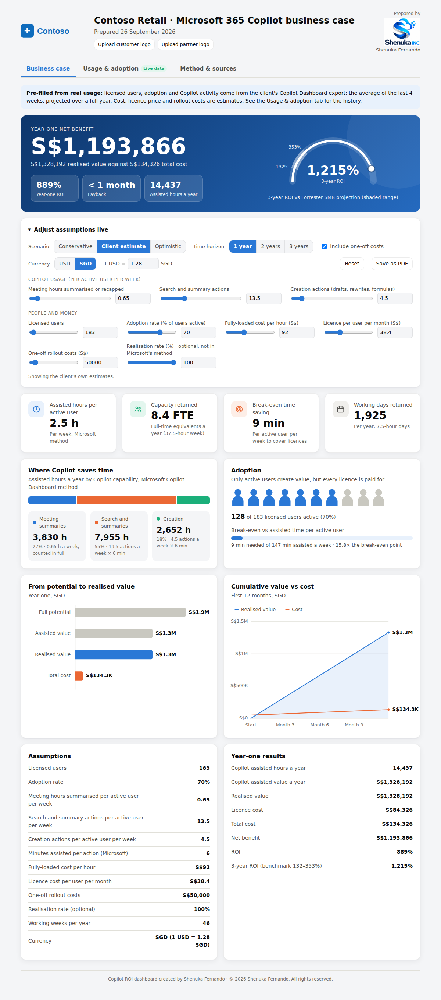
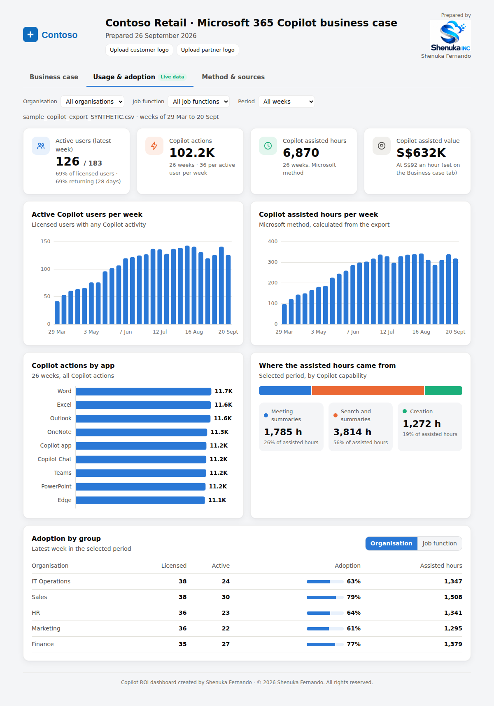

# Copilot Consultant MCP Server

**Created by Shenuka Fernando.** © 2026 Shenuka Fernando. All rights reserved. See [COPYRIGHT](COPYRIGHT).

> Independent personal project by Shenuka INC. Not an official Microsoft product, and not endorsed by Microsoft.

A beginner-friendly [Model Context Protocol](https://modelcontextprotocol.io) server that gives an AI assistant tools a Microsoft Copilot consultant uses with clients. It has no API keys or databases.

| File | Job |
|------|-----|
| `server.py` | The MCP tools, resources and prompt, plus the default partner branding |
| `roi.py` | The ROI maths, using Microsoft's "Copilot assisted hours" method |
| `copilot_export.py` | Reads a Microsoft Copilot Dashboard data export (CSV) |
| `dashboard.py` | Builds the interactive, multi-tab HTML dashboard |
| `assets/` | Partner logos (`partners/`, default Shenuka INC) and customer logos (`customers/`) |
| `samples/` | Synthetic Copilot Dashboard export for testing |

| Type | Name | What it does |
|------|------|--------------|
| Tool | `recommend_tier` | Picks Tier 1 (Agent Builder), 2 (Copilot Studio) or 3 (Azure AI Foundry) |
| Tool | `assess_readiness` | Scores Copilot adoption readiness out of 100 and lists gaps |
| Tool | `find_use_cases` | Suggests agent use cases by industry and function |
| Tool | `estimate_roi` | Copilot ROI in text, using Microsoft's assisted-hours method |
| Tool | `summarise_copilot_export` | Summarises a Copilot Dashboard export and calculates assisted hours |
| Tool | `create_roi_dashboard` | Saves an interactive, branded HTML dashboard to `output/` |
| Tool | `list_logos` | Lists the partner and customer logos saved in `assets/` |
| Tool | `plan_build_along` | Outlines an Agent Build-Along session |
| Resource | `consultant://tiers` | Overview of the three build tiers |
| Resource | `consultant://copilot-export-guide` | How to export usage data from the Copilot Dashboard |
| Prompt | `discovery_call` | Prepares questions for a client discovery call |

## How the ROI is calculated

The value side follows Microsoft's published **Copilot assisted hours** method from the
[Microsoft Copilot Dashboard in Viva Insights](https://learn.microsoft.com/viva/insights/org-team-insights/copilot-dashboard#impact):

- **Copilot assisted hours** = meeting hours summarised or recapped
  + 6 minutes × search and summary actions (Copilot Chat prompts, summarise email/document/chat, Excel analysis)
  + 6 minutes × creation actions (draft email/document/presentation, rewrite, Excel formulas)
- **Copilot assisted value** = assisted hours × hourly rate (Microsoft's default is $72, from US Bureau of Labor Statistics data)

The 6-minute factors come from [Microsoft research with knowledge workers](https://www.microsoft.com/en-us/worklab/work-trend-index/copilots-earliest-users-teach-us-about-generative-ai-at-work).
Microsoft calls assisted hours a broad, directional estimate.

The business case adds the standard steps Microsoft's dashboard doesn't do:

- Weekly activity per active user × active users × 46 working weeks
- **Cost** = licences for all licensed users × 12 + one-off rollout costs
- **ROI** = (value − cost) ÷ cost, and **payback** = one-off costs ÷ monthly (value − licence cost)
- An optional **realisation rate**, a conservatism factor that is *not* part of Microsoft's method. Keep it at 100% to match Microsoft.
- A benchmark: Forrester's [projected Total Economic Impact of Microsoft 365 Copilot for SMB](https://www.microsoft.com/en-us/microsoft-365/blog/2024/10/17/microsoft-365-copilot-drove-up-to-353-roi-for-small-and-medium-businesses-new-study/) (commissioned by Microsoft), which gives a 3-year ROI of 132%–353%

## Using real Copilot usage data

1. Someone with global access to the Copilot Dashboard (for example a Microsoft 365 Global Administrator) opens
   **Copilot Dashboard > Export data > Export by week**. The tenant needs at least 50 Copilot or Viva Insights licences.
   See [Microsoft's export guide](https://learn.microsoft.com/viva/insights/org-team-insights/export-copilot-metrics).
2. Give the CSV path to the assistant:

   > Create an ROI dashboard for Contoso from C:\Users\me\Downloads\CopilotExport.csv, in SGD. S$92 an hour, S$38.40 per licence, S$50,000 rollout costs.

The export has one row per person per week, with anonymised IDs. It doesn't include assisted hours, so
`copilot_export.py` calculates them from the activity columns using Microsoft's formula. Columns are matched by
Microsoft's documented metric names. The first time you use a real export, check the list of any missing columns
that `summarise_copilot_export` reports. Try it with `samples/sample_copilot_export_SYNTHETIC.csv` first.

## Currencies: USD and SGD

Every ROI tool takes `currency` (`"USD"` or `"SGD"`, the currency of the money values you give) and
`sgd_per_usd` (the exchange rate, default 1.28, the mid-market rate in September 2026). `estimate_roi`
reports every amount in both currencies. The dashboard opens in the currency you chose and has a
**USD / SGD** switch and an editable exchange rate, so the whole page converts live. ROI %, payback and
hours don't depend on currency. Update the default rate in `roi.py` (`DEFAULT_SGD_PER_USD`) as rates move.

## The dashboard

`create_roi_dashboard` writes one HTML file to `output/`. It works offline and prints to PDF, and the customer's
logo is embedded in the file.

| Tab | What's on it |
|-----|--------------|
| **Business case** | Net benefit, a gauge of 3-year ROI against the benchmark, KPI tiles, time saved by capability, an adoption pictogram and break-even meter, and value and payback charts. Sliders, scenarios (Conservative / Client estimate / Optimistic), a 1–3 year horizon, a one-off cost toggle and a USD/SGD switch update everything live. |
| **Usage & adoption** | From a Copilot Dashboard export: active users and assisted hours per week, actions by app, hours by capability, and adoption by organisation or job function. Filters for organisation, job function and period. |
| **Method & sources** | The formulas and links to Microsoft's documentation |




## Logos

Every dashboard shows two logos: the **customer** (top left) and the **partner** preparing the business
case ("Prepared by", top right). Each can be set in any of these ways:

| Option | Customer logo | Partner logo |
|--------|---------------|--------------|
| Default | Looked up by customer name in `assets/customers/` | **Shenuka INC** (`assets/partners/shenuka-inc.png`) |
| Tell the assistant | `logo`: file path, `https://` URL, or a name saved in `assets/customers/` | `partner_name`, and `partner_logo` the same ways (looked up in `assets/partners/`) |
| On the dashboard | **Upload customer logo** | **Upload partner logo** |

After uploading on the dashboard, select **Save dashboard with these logos** to download a copy with the
logos built in. Web images are downloaded and embedded so the file works offline.

Images attached in a chat can't be handed to MCP tools (tools only receive text such as paths and URLs),
which is why the dashboard has its own upload buttons.

Example: *"Create the dashboard for Contoso, partner Fabrikam Consulting, partner logo
C:\Logos\fabrikam.png."*

## Setup (Windows PowerShell)

```powershell
git clone https://github.com/shenukaf69/Custom_MCP.git
cd Custom_MCP
python -m venv .venv
.venv\Scripts\Activate.ps1
pip install -r requirements.txt
```

No Git? On GitHub select **Code > Download ZIP** and unzip it instead.

If PowerShell says running scripts is disabled, run `Set-ExecutionPolicy -Scope CurrentUser RemoteSigned` once.

## Quick test without an AI app

```powershell
python demo.py
```

This summarises the sample export, prints an ROI estimate and opens a sample dashboard in your browser.

## Test with MCP Inspector (needs Node.js)

```powershell
mcp dev server.py
```

## Connect to Claude Desktop

In Claude Desktop open **Settings > Developer > Edit Config**, add this (with your own path), then fully quit and reopen Claude:

```json
{
  "mcpServers": {
    "copilot-consultant": {
      "command": "C:\\Users\\you\\Custom_MCP\\.venv\\Scripts\\python.exe",
      "args": ["C:\\Users\\you\\Custom_MCP\\server.py"]
    }
  }
}
```
