# Try it: commands and prompts

Created by Shenuka Fernando. © 2026 Shenuka Fernando. All rights reserved.

Everything below uses the sample files in `samples/`, so you can try every tool without client data.
`samples/sample_copilot_export_SYNTHETIC.csv` is made-up data in the Copilot Dashboard export format.

## Setup and updates (PowerShell)

First time:
```powershell
cd C:\Users\shenu
git clone https://github.com/shenukaf69/Custom_MCP.git
cd Custom_MCP
python -m venv .venv
.venv\Scripts\Activate.ps1
pip install -r requirements.txt
python demo.py
```

After changes on GitHub:
```powershell
cd C:\Users\shenu\Custom_MCP
.venv\Scripts\Activate.ps1
git pull
pip install -r requirements.txt
```
Then fully quit Claude (tray icon > Quit) and reopen it so it loads the new code.

`python demo.py` builds a sample dashboard and PowerPoint deck in `output\` and opens the dashboard.


---

## Prompts for Claude Desktop

Paste these into a new chat. Claude asks permission the first time it uses each tool.

### Check it's connected
```
What tools does copilot-consultant have?
```
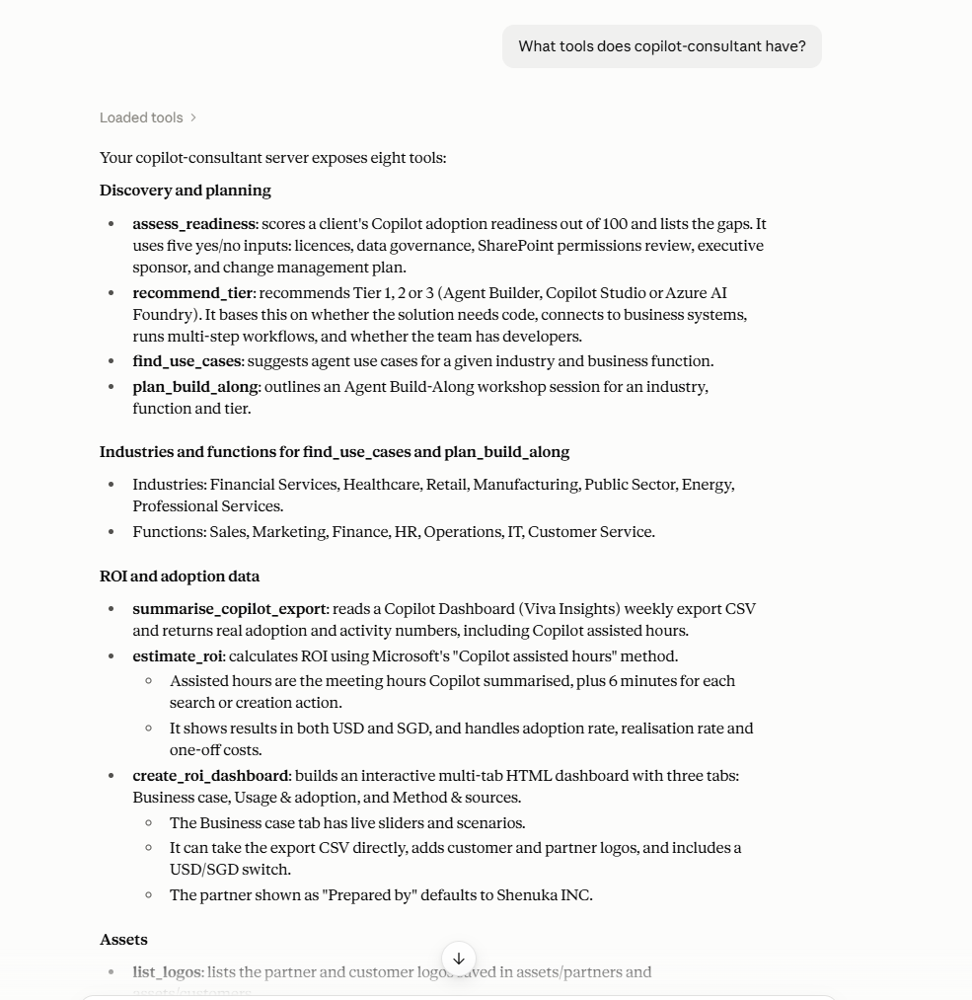

### Discovery and planning
```
Assess Copilot readiness for a client: they have Copilot licences, an executive sponsor and a change management plan, but no data governance (labels/DLP) and SharePoint permissions haven't been reviewed.
```
```
A client wants an agent that connects to their CRM, but they have no developers. Which tier should they use?
```
```
Suggest Copilot agent use cases for the HR function in Healthcare.
```
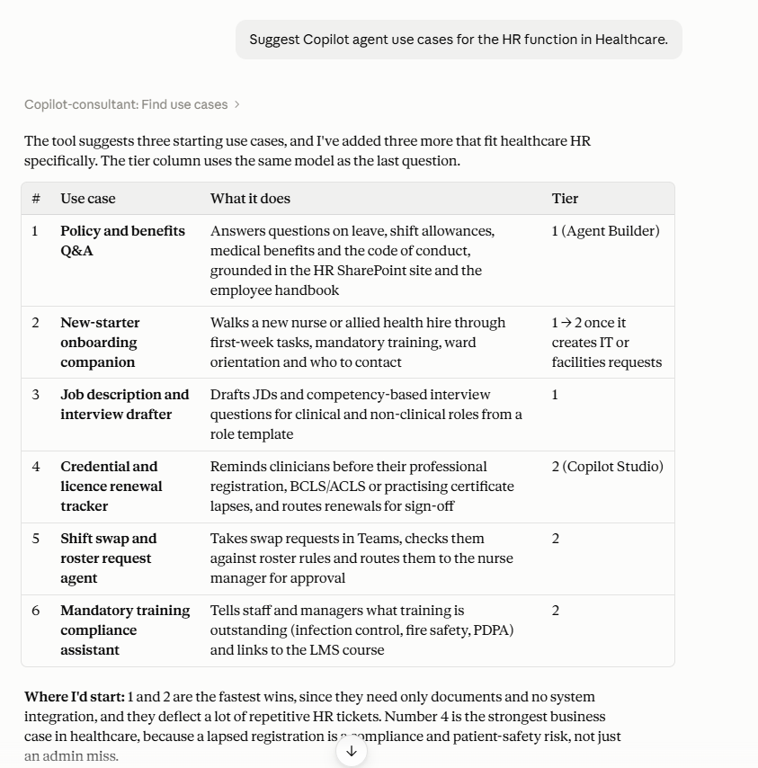

```
Plan a Tier 2 Build-Along for Customer Service in Financial Services.
```
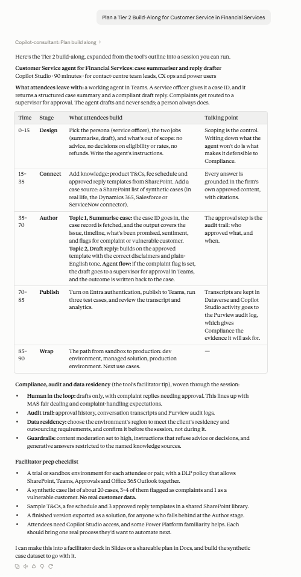

```
I'm meeting a Retail client's Operations team next week. They have Copilot licences and an exec sponsor, no change plan, DLP in place, SharePoint not reviewed. They want an agent that checks inventory in their ERP and raises supplier requests. Assess readiness, recommend a tier, suggest use cases and plan the Build-Along.
```
Claude calls four tools in one go and writes a meeting brief:

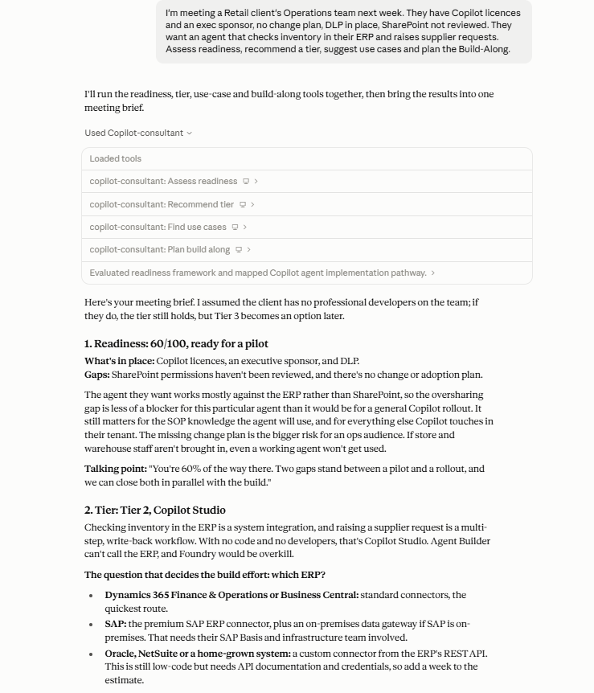
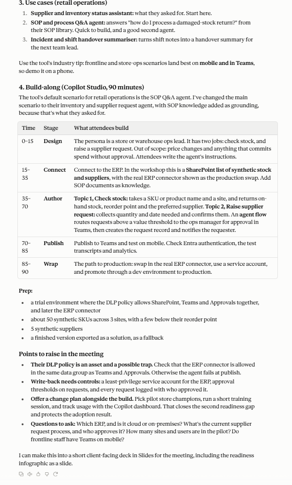

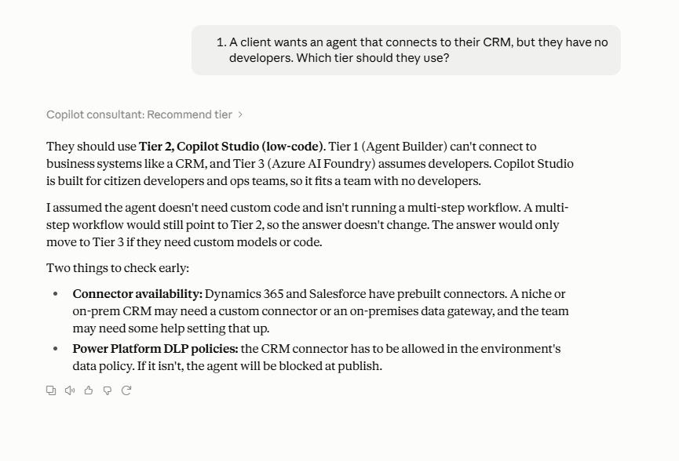

### Analysis
```
Summarise the Copilot export at C:\Users\shenu\Custom_MCP\samples\sample_copilot_export_SYNTHETIC.csv
```
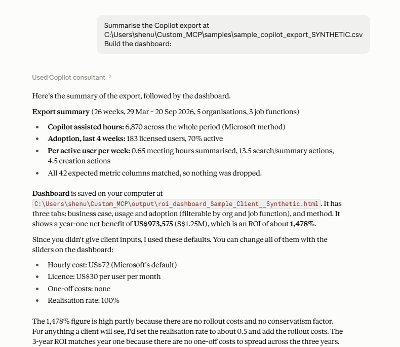

```
Estimate Copilot ROI in SGD: 300 users, 70% adoption, 1 meeting hour summarised, 10 search actions and 5 creation actions per user per week, hourly cost 92, licence 38.4 per month, one-off costs 50000.
```
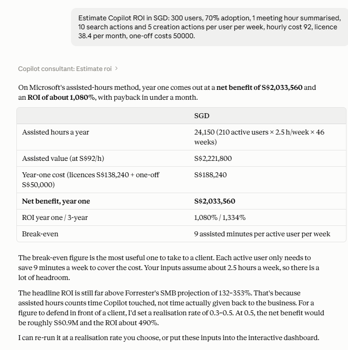


Download real usage from the client's tenant with Microsoft Graph. This needs the one-off setup in
[INSTALL.md section H](INSTALL.md#h-automatic-copilot-usage-download-microsoft-graph):
```
Download Copilot usage for the last 28 days.
```
```
Download Contoso's Copilot usage for the last 90 days and estimate the ROI in SGD from it: S$92 an hour, S$38.40 per licence, S$50,000 rollout costs, 1 meeting hour and 3 creation actions per user per week.
```
The three CSVs go to your Downloads folder. Graph has prompts and adoption but no meeting hours or creation
actions, so give estimates for those (or use a Copilot Dashboard export).

### Build: dashboard
```
Create an ROI dashboard for Demo Client using the Copilot export at C:\Users\shenu\Custom_MCP\samples\sample_copilot_export_SYNTHETIC.csv. Currency SGD: hourly cost 92, licence cost per user per month 38.4, one-off costs 50000. Prepared by Shenuka Fernando.
```
The dashboard's three tabs:

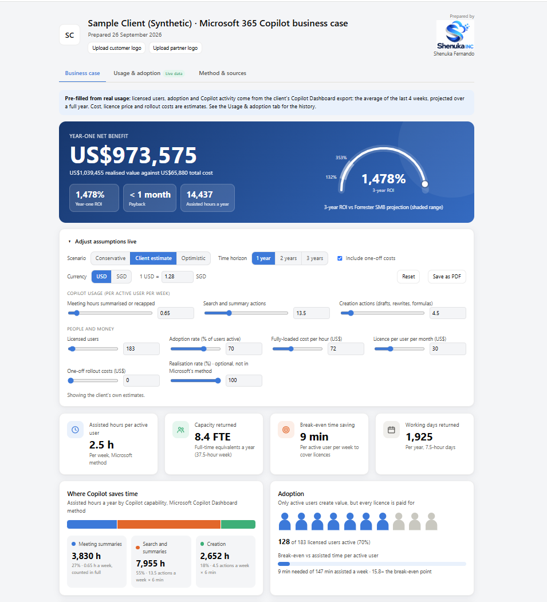
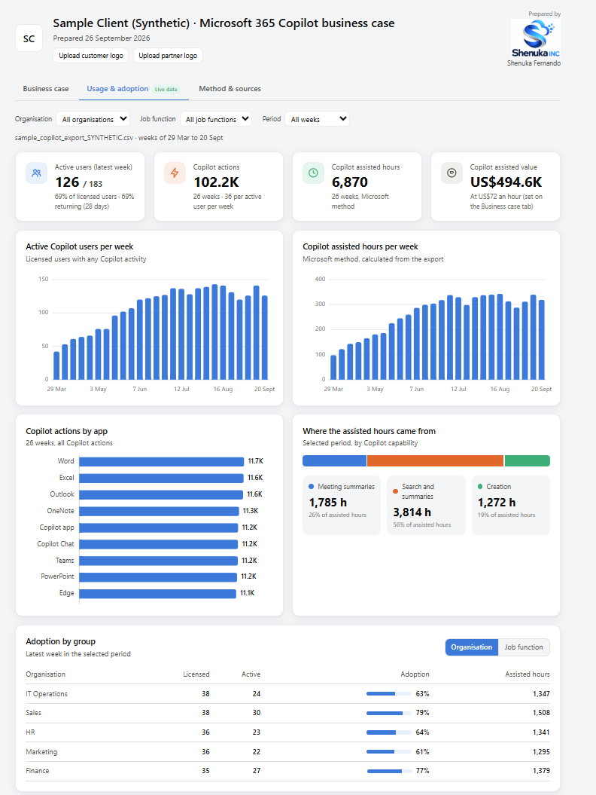
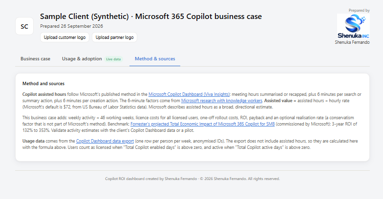

Always give the hourly cost, licence price and rollout costs. If you leave them out, Claude should ask for them.


### Build: PowerPoint deck
```
Create a client deck for Demo Client in SGD using C:\Users\shenu\Custom_MCP\samples\sample_copilot_export_SYNTHETIC.csv: S$92 an hour, S$38.40 per licence, S$50,000 rollout costs. Readiness: licences yes, DLP no, SharePoint reviewed no, sponsor yes, change plan yes. Retail, Operations. Prepared by Shenuka Fernando.
```
With your own template (widescreen .pptx or .potx):
```
Create the same client deck using my template C:\Users\shenu\Documents\my-template.pptx
```
Readiness only:
```
Create a readiness deck for Contoso: licences yes, DLP no, SharePoint reviewed yes, sponsor no, change plan yes.
```
An example of the result is in [`samples/Sample_Copilot_Deck_Contoso.pptx`](samples/Sample_Copilot_Deck_Contoso.pptx).

### Logos
```
List the partner and customer logos you have.
```
```
Create the dashboard for Contoso with partner Fabrikam Consulting, partner logo C:\Logos\fabrikam.png
```

Here's what Claude did with the readiness result, turned into an infographic in chat:

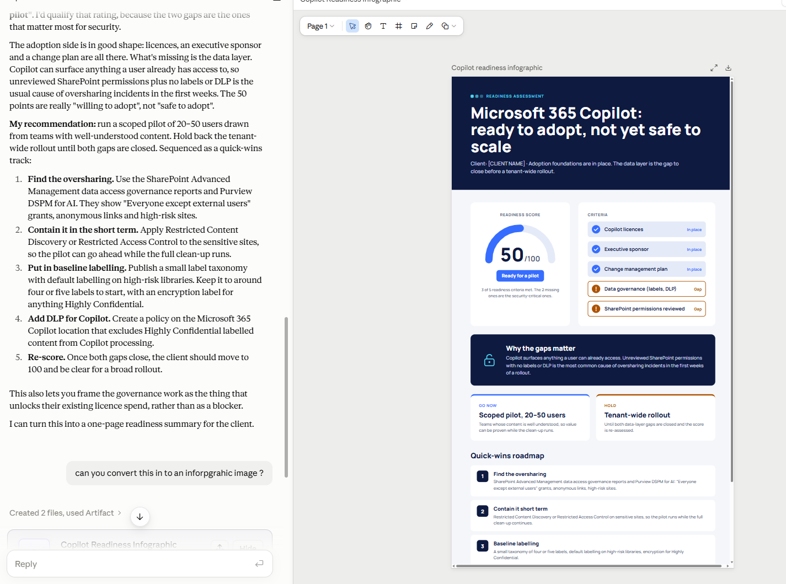

---

## PowerShell: call the tools directly (no Claude needed)

Run these in `C:\Users\shenu\Custom_MCP` with `(.venv)` active.

```powershell
# Discovery and planning
python -c "import server; print(server.assess_readiness(has_copilot_licences=True, data_governance_in_place=False, sharepoint_permissions_reviewed=False, executive_sponsor=True, change_management_plan=True))"
python -c "import server; print(server.recommend_tier(needs_code=False, connects_to_business_systems=True, multi_step_workflow=True, team_has_developers=False))"
python -c "import server; print(server.find_use_cases(industry='Healthcare', function='HR'))"
python -c "import server; print(server.plan_build_along(tier='Tier 2', industry='Financial Services', function='Customer Service'))"

# Analysis
python -c "import server; print(server.summarise_copilot_export(r'samples\sample_copilot_export_SYNTHETIC.csv'))"
python -c "import server; print(server.estimate_roi(users=300, hourly_cost=92, licence_cost_per_user_per_month=38.4, meeting_hours_per_week=1, search_actions_per_week=10, creation_actions_per_week=5, adoption_rate=0.7, one_off_costs=50000, currency='SGD'))"

# Build: dashboard
python -c "import server; print(server.create_roi_dashboard(client_name='Demo Client', hourly_cost=92, licence_cost_per_user_per_month=38.4, copilot_export_csv=r'samples\sample_copilot_export_SYNTHETIC.csv', one_off_costs=50000, currency='SGD', prepared_by='Shenuka Fernando'))"
start output\roi_dashboard_Demo_Client.html

# Build: PowerPoint deck
python -c "import server; print(server.create_client_deck(client_name='Demo Client', currency='SGD', prepared_by='Shenuka Fernando', has_copilot_licences=True, data_governance_in_place=False, sharepoint_permissions_reviewed=False, executive_sponsor=True, change_management_plan=True, needs_code=False, connects_to_business_systems=True, multi_step_workflow=True, team_has_developers=False, industry='Retail', function='Operations', hourly_cost=92, licence_cost_per_user_per_month=38.4, copilot_export_csv=r'samples\sample_copilot_export_SYNTHETIC.csv', one_off_costs=50000))"
start output\copilot_deck_Demo_Client.pptx

# Logos
python -c "import server; print(server.list_logos())"

# Copilot usage from Microsoft Graph (after the setup in INSTALL.md section H)
python -c "import server; print(server.download_copilot_usage(period='D28'))"
python -c "import server; print(server.download_copilot_usage(period='D90', tenant_profile='contoso'))"
```

Valid values: industry is Financial Services, Healthcare, Retail, Manufacturing, Public Sector, Energy or
Professional Services; function is Sales, Marketing, Finance, HR, Operations, IT or Customer Service;
tier is Tier 1, Tier 2 or Tier 3; currency is USD or SGD.

## Web-service mode (for Microsoft 365)

```powershell
$env:MCP_API_KEY = "make-up-a-long-random-key"
python server.py --http
```
In a second PowerShell window:
```powershell
Invoke-RestMethod http://localhost:8000/health
```
It should return `ok`. Next steps for Copilot Studio, Cowork and Microsoft 365 Copilot are in [DEPLOYMENT.md](DEPLOYMENT.md).
